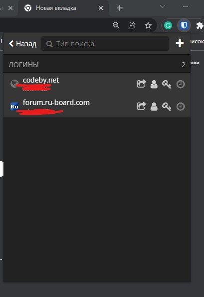
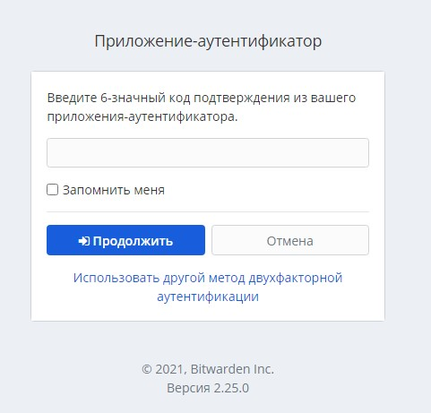
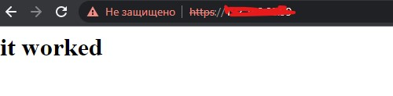

1. Установите Bitwarden плагин для браузера. Зарегестрируйтесь и сохраните несколько паролей.  
  
2. Установите Google authenticator на мобильный телефон. Настройте вход в Bitwarden акаунт через Google authenticator OTP.  
  
3. Установите apache2, сгенерируйте самоподписанный сертификат, настройте тестовый сайт для работы по HTTPS.  
* Сгенерировал сертификат
* настроил тестовый сайт и редирект с http на https  



4. Проверьте на TLS уязвимости произвольный сайт в интернете (кроме сайтов МВД, ФСБ, МинОбр, НацБанк, РосКосмос, РосАтом, РосНАНО и любых госкомпаний, объектов КИИ, ВПК ... и тому подобное).  
```
./testssl.sh -e --fast --parallel https://www.google.com/

###########################################################
    testssl.sh       3.1dev from https://testssl.sh/dev/
    (35ddd91 2021-12-21 10:54:58 -- )

      This program is free software. Distribution and
             modification under GPLv2 permitted.
      USAGE w/o ANY WARRANTY. USE IT AT YOUR OWN RISK!

       Please file bugs @ https://testssl.sh/bugs/

###########################################################

 Using "OpenSSL 1.0.2-chacha (1.0.2k-dev)" [~183 ciphers]
 on ubuntu-vm:./bin/openssl.Linux.x86_64
 (built: "Jan 18 17:12:17 2019", platform: "linux-x86_64")


Testing all IPv4 addresses (port 443): 64.233.163.99 64.233.163.147 64.233.163.103 64.233.163.104 64.233.163.105 64.233.163.106
-------------------------------------------------------------------------------------------------------------------------------
 Start 2021-12-26 23:11:12        -->> 64.233.163.99:443 (www.google.com) <<--

 Further IP addresses:   64.233.165.99 64.233.165.103 64.233.165.104 64.233.165.106 64.233.165.105 64.233.165.147 2a00:1450:4010:c08::69 2a00:1450:4010:c08::63 2a00:1450:4010:c08::93
                         2a00:1450:4010:c08::67 
 rDNS (64.233.163.99):   lj-in-f99.1e100.net.
 Service detected:       HTTP


 Testing all 183 locally available ciphers against the server, ordered by encryption strength 


Hexcode  Cipher Suite Name (OpenSSL)       KeyExch.   Encryption  Bits     Cipher Suite Name (IANA/RFC)
-----------------------------------------------------------------------------------------------------------------------------
 xc030   ECDHE-RSA-AES256-GCM-SHA384       ECDH 256   AESGCM      256      TLS_ECDHE_RSA_WITH_AES_256_GCM_SHA384              
 xc02c   ECDHE-ECDSA-AES256-GCM-SHA384     ECDH 256   AESGCM      256      TLS_ECDHE_ECDSA_WITH_AES_256_GCM_SHA384            
 xc014   ECDHE-RSA-AES256-SHA              ECDH 256   AES         256      TLS_ECDHE_RSA_WITH_AES_256_CBC_SHA                 
 xc00a   ECDHE-ECDSA-AES256-SHA            ECDH 256   AES         256      TLS_ECDHE_ECDSA_WITH_AES_256_CBC_SHA               
 x9d     AES256-GCM-SHA384                 RSA        AESGCM      256      TLS_RSA_WITH_AES_256_GCM_SHA384                    
 x35     AES256-SHA                        RSA        AES         256      TLS_RSA_WITH_AES_256_CBC_SHA                       
 xc02f   ECDHE-RSA-AES128-GCM-SHA256       ECDH 256   AESGCM      128      TLS_ECDHE_RSA_WITH_AES_128_GCM_SHA256              
 xc02b   ECDHE-ECDSA-AES128-GCM-SHA256     ECDH 256   AESGCM      128      TLS_ECDHE_ECDSA_WITH_AES_128_GCM_SHA256            
 xc013   ECDHE-RSA-AES128-SHA              ECDH 256   AES         128      TLS_ECDHE_RSA_WITH_AES_128_CBC_SHA                 
 xc009   ECDHE-ECDSA-AES128-SHA            ECDH 256   AES         128      TLS_ECDHE_ECDSA_WITH_AES_128_CBC_SHA               
 x9c     AES128-GCM-SHA256                 RSA        AESGCM      128      TLS_RSA_WITH_AES_128_GCM_SHA256                    
 x2f     AES128-SHA                        RSA        AES         128      TLS_RSA_WITH_AES_128_CBC_SHA                       
 x0a     DES-CBC3-SHA                      RSA        3DES        168      TLS_RSA_WITH_3DES_EDE_CBC_SHA                      


 Done 2021-12-26 23:11:16 [   6s] -->> 64.233.163.99:443 (www.google.com) <<--

-------------------------------------------------------------------------------------------------------------------------------
 Start 2021-12-26 23:11:16        -->> 64.233.163.147:443 (www.google.com) <<--

 Further IP addresses:   64.233.165.99 64.233.165.103 64.233.165.104 64.233.165.106 64.233.165.105 64.233.165.147 2a00:1450:4010:c08::69 2a00:1450:4010:c08::63 2a00:1450:4010:c08::93
                         2a00:1450:4010:c08::67 
 rDNS (64.233.163.147):  lj-in-f147.1e100.net.
 Service detected:       HTTP


 Testing all 183 locally available ciphers against the server, ordered by encryption strength 


Hexcode  Cipher Suite Name (OpenSSL)       KeyExch.   Encryption  Bits     Cipher Suite Name (IANA/RFC)
-----------------------------------------------------------------------------------------------------------------------------
 xc030   ECDHE-RSA-AES256-GCM-SHA384       ECDH 256   AESGCM      256      TLS_ECDHE_RSA_WITH_AES_256_GCM_SHA384              
 xc02c   ECDHE-ECDSA-AES256-GCM-SHA384     ECDH 256   AESGCM      256      TLS_ECDHE_ECDSA_WITH_AES_256_GCM_SHA384            
 xc014   ECDHE-RSA-AES256-SHA              ECDH 256   AES         256      TLS_ECDHE_RSA_WITH_AES_256_CBC_SHA                 
 xc00a   ECDHE-ECDSA-AES256-SHA            ECDH 256   AES         256      TLS_ECDHE_ECDSA_WITH_AES_256_CBC_SHA               
 x9d     AES256-GCM-SHA384                 RSA        AESGCM      256      TLS_RSA_WITH_AES_256_GCM_SHA384                    
 x35     AES256-SHA                        RSA        AES         256      TLS_RSA_WITH_AES_256_CBC_SHA                       
 xc02f   ECDHE-RSA-AES128-GCM-SHA256       ECDH 256   AESGCM      128      TLS_ECDHE_RSA_WITH_AES_128_GCM_SHA256              
 xc02b   ECDHE-ECDSA-AES128-GCM-SHA256     ECDH 256   AESGCM      128      TLS_ECDHE_ECDSA_WITH_AES_128_GCM_SHA256            
 xc013   ECDHE-RSA-AES128-SHA              ECDH 256   AES         128      TLS_ECDHE_RSA_WITH_AES_128_CBC_SHA                 
 xc009   ECDHE-ECDSA-AES128-SHA            ECDH 256   AES         128      TLS_ECDHE_ECDSA_WITH_AES_128_CBC_SHA               
 x9c     AES128-GCM-SHA256                 RSA        AESGCM      128      TLS_RSA_WITH_AES_128_GCM_SHA256                    
 x2f     AES128-SHA                        RSA        AES         128      TLS_RSA_WITH_AES_128_CBC_SHA                       
 x0a     DES-CBC3-SHA                      RSA        3DES        168      TLS_RSA_WITH_3DES_EDE_CBC_SHA                      


 Done 2021-12-26 23:11:21 [  11s] -->> 64.233.163.147:443 (www.google.com) <<--

-------------------------------------------------------------------------------------------------------------------------------
 Start 2021-12-26 23:11:21        -->> 64.233.163.103:443 (www.google.com) <<--

 Further IP addresses:   64.233.165.99 64.233.165.103 64.233.165.104 64.233.165.106 64.233.165.105 64.233.165.147 2a00:1450:4010:c08::69 2a00:1450:4010:c08::63 2a00:1450:4010:c08::93
                         2a00:1450:4010:c08::67 
 rDNS (64.233.163.103):  lj-in-f103.1e100.net.
 Service detected:       HTTP


 Testing all 183 locally available ciphers against the server, ordered by encryption strength 


Hexcode  Cipher Suite Name (OpenSSL)       KeyExch.   Encryption  Bits     Cipher Suite Name (IANA/RFC)
-----------------------------------------------------------------------------------------------------------------------------
 xc030   ECDHE-RSA-AES256-GCM-SHA384       ECDH 256   AESGCM      256      TLS_ECDHE_RSA_WITH_AES_256_GCM_SHA384              
 xc02c   ECDHE-ECDSA-AES256-GCM-SHA384     ECDH 256   AESGCM      256      TLS_ECDHE_ECDSA_WITH_AES_256_GCM_SHA384            
 xc014   ECDHE-RSA-AES256-SHA              ECDH 256   AES         256      TLS_ECDHE_RSA_WITH_AES_256_CBC_SHA                 
 xc00a   ECDHE-ECDSA-AES256-SHA            ECDH 256   AES         256      TLS_ECDHE_ECDSA_WITH_AES_256_CBC_SHA               
 x9d     AES256-GCM-SHA384                 RSA        AESGCM      256      TLS_RSA_WITH_AES_256_GCM_SHA384                    
 x35     AES256-SHA                        RSA        AES         256      TLS_RSA_WITH_AES_256_CBC_SHA                       
 xc02f   ECDHE-RSA-AES128-GCM-SHA256       ECDH 256   AESGCM      128      TLS_ECDHE_RSA_WITH_AES_128_GCM_SHA256              
 xc02b   ECDHE-ECDSA-AES128-GCM-SHA256     ECDH 256   AESGCM      128      TLS_ECDHE_ECDSA_WITH_AES_128_GCM_SHA256            
 xc013   ECDHE-RSA-AES128-SHA              ECDH 256   AES         128      TLS_ECDHE_RSA_WITH_AES_128_CBC_SHA                 
 xc009   ECDHE-ECDSA-AES128-SHA            ECDH 256   AES         128      TLS_ECDHE_ECDSA_WITH_AES_128_CBC_SHA               
 x9c     AES128-GCM-SHA256                 RSA        AESGCM      128      TLS_RSA_WITH_AES_128_GCM_SHA256                    
 x2f     AES128-SHA                        RSA        AES         128      TLS_RSA_WITH_AES_128_CBC_SHA                       
 x0a     DES-CBC3-SHA                      RSA        3DES        168      TLS_RSA_WITH_3DES_EDE_CBC_SHA                      


 Done 2021-12-26 23:11:26 [  16s] -->> 64.233.163.103:443 (www.google.com) <<--

-------------------------------------------------------------------------------------------------------------------------------
 Start 2021-12-26 23:11:26        -->> 64.233.163.104:443 (www.google.com) <<--

 Further IP addresses:   64.233.165.99 64.233.165.103 64.233.165.104 64.233.165.106 64.233.165.105 64.233.165.147 2a00:1450:4010:c08::69 2a00:1450:4010:c08::63 2a00:1450:4010:c08::93
                         2a00:1450:4010:c08::67 
 rDNS (64.233.163.104):  lj-in-f104.1e100.net.
 Service detected:       HTTP


 Testing all 183 locally available ciphers against the server, ordered by encryption strength 


Hexcode  Cipher Suite Name (OpenSSL)       KeyExch.   Encryption  Bits     Cipher Suite Name (IANA/RFC)
-----------------------------------------------------------------------------------------------------------------------------
 xc030   ECDHE-RSA-AES256-GCM-SHA384       ECDH 256   AESGCM      256      TLS_ECDHE_RSA_WITH_AES_256_GCM_SHA384              
 xc02c   ECDHE-ECDSA-AES256-GCM-SHA384     ECDH 256   AESGCM      256      TLS_ECDHE_ECDSA_WITH_AES_256_GCM_SHA384            
 xc014   ECDHE-RSA-AES256-SHA              ECDH 256   AES         256      TLS_ECDHE_RSA_WITH_AES_256_CBC_SHA                 
 xc00a   ECDHE-ECDSA-AES256-SHA            ECDH 256   AES         256      TLS_ECDHE_ECDSA_WITH_AES_256_CBC_SHA               
 x9d     AES256-GCM-SHA384                 RSA        AESGCM      256      TLS_RSA_WITH_AES_256_GCM_SHA384                    
 x35     AES256-SHA                        RSA        AES         256      TLS_RSA_WITH_AES_256_CBC_SHA                       
 xc02f   ECDHE-RSA-AES128-GCM-SHA256       ECDH 256   AESGCM      128      TLS_ECDHE_RSA_WITH_AES_128_GCM_SHA256              
 xc02b   ECDHE-ECDSA-AES128-GCM-SHA256     ECDH 256   AESGCM      128      TLS_ECDHE_ECDSA_WITH_AES_128_GCM_SHA256            
 xc013   ECDHE-RSA-AES128-SHA              ECDH 256   AES         128      TLS_ECDHE_RSA_WITH_AES_128_CBC_SHA                 
 xc009   ECDHE-ECDSA-AES128-SHA            ECDH 256   AES         128      TLS_ECDHE_ECDSA_WITH_AES_128_CBC_SHA               
 x9c     AES128-GCM-SHA256                 RSA        AESGCM      128      TLS_RSA_WITH_AES_128_GCM_SHA256                    
 x2f     AES128-SHA                        RSA        AES         128      TLS_RSA_WITH_AES_128_CBC_SHA                       
 x0a     DES-CBC3-SHA                      RSA        3DES        168      TLS_RSA_WITH_3DES_EDE_CBC_SHA                      


 Done 2021-12-26 23:11:30 [  20s] -->> 64.233.163.104:443 (www.google.com) <<--

-------------------------------------------------------------------------------------------------------------------------------
 Start 2021-12-26 23:11:30        -->> 64.233.163.105:443 (www.google.com) <<--

 Further IP addresses:   64.233.165.99 64.233.165.103 64.233.165.104 64.233.165.106 64.233.165.105 64.233.165.147 2a00:1450:4010:c08::69 2a00:1450:4010:c08::63 2a00:1450:4010:c08::93
                         2a00:1450:4010:c08::67 
 rDNS (64.233.163.105):  lj-in-f105.1e100.net.
 Service detected:       HTTP


 Testing all 183 locally available ciphers against the server, ordered by encryption strength 


Hexcode  Cipher Suite Name (OpenSSL)       KeyExch.   Encryption  Bits     Cipher Suite Name (IANA/RFC)
-----------------------------------------------------------------------------------------------------------------------------
 xc030   ECDHE-RSA-AES256-GCM-SHA384       ECDH 256   AESGCM      256      TLS_ECDHE_RSA_WITH_AES_256_GCM_SHA384              
 xc02c   ECDHE-ECDSA-AES256-GCM-SHA384     ECDH 256   AESGCM      256      TLS_ECDHE_ECDSA_WITH_AES_256_GCM_SHA384            
 xc014   ECDHE-RSA-AES256-SHA              ECDH 256   AES         256      TLS_ECDHE_RSA_WITH_AES_256_CBC_SHA                 
 xc00a   ECDHE-ECDSA-AES256-SHA            ECDH 256   AES         256      TLS_ECDHE_ECDSA_WITH_AES_256_CBC_SHA               
 x9d     AES256-GCM-SHA384                 RSA        AESGCM      256      TLS_RSA_WITH_AES_256_GCM_SHA384                    
 x35     AES256-SHA                        RSA        AES         256      TLS_RSA_WITH_AES_256_CBC_SHA                       
 xc02f   ECDHE-RSA-AES128-GCM-SHA256       ECDH 256   AESGCM      128      TLS_ECDHE_RSA_WITH_AES_128_GCM_SHA256              
 xc02b   ECDHE-ECDSA-AES128-GCM-SHA256     ECDH 256   AESGCM      128      TLS_ECDHE_ECDSA_WITH_AES_128_GCM_SHA256            
 xc013   ECDHE-RSA-AES128-SHA              ECDH 256   AES         128      TLS_ECDHE_RSA_WITH_AES_128_CBC_SHA                 
 xc009   ECDHE-ECDSA-AES128-SHA            ECDH 256   AES         128      TLS_ECDHE_ECDSA_WITH_AES_128_CBC_SHA               
 x9c     AES128-GCM-SHA256                 RSA        AESGCM      128      TLS_RSA_WITH_AES_128_GCM_SHA256                    
 x2f     AES128-SHA                        RSA        AES         128      TLS_RSA_WITH_AES_128_CBC_SHA                       
 x0a     DES-CBC3-SHA                      RSA        3DES        168      TLS_RSA_WITH_3DES_EDE_CBC_SHA                      


 Done 2021-12-26 23:11:35 [  25s] -->> 64.233.163.105:443 (www.google.com) <<--

-------------------------------------------------------------------------------------------------------------------------------
 Start 2021-12-26 23:11:35        -->> 64.233.163.106:443 (www.google.com) <<--

 Further IP addresses:   64.233.165.99 64.233.165.103 64.233.165.104 64.233.165.106 64.233.165.105 64.233.165.147 2a00:1450:4010:c08::69 2a00:1450:4010:c08::63 2a00:1450:4010:c08::93
                         2a00:1450:4010:c08::67 
 rDNS (64.233.163.106):  lj-in-f106.1e100.net.
 Service detected:       HTTP


 Testing all 183 locally available ciphers against the server, ordered by encryption strength 


Hexcode  Cipher Suite Name (OpenSSL)       KeyExch.   Encryption  Bits     Cipher Suite Name (IANA/RFC)
-----------------------------------------------------------------------------------------------------------------------------
 xc030   ECDHE-RSA-AES256-GCM-SHA384       ECDH 256   AESGCM      256      TLS_ECDHE_RSA_WITH_AES_256_GCM_SHA384              
 xc02c   ECDHE-ECDSA-AES256-GCM-SHA384     ECDH 256   AESGCM      256      TLS_ECDHE_ECDSA_WITH_AES_256_GCM_SHA384            
 xc014   ECDHE-RSA-AES256-SHA              ECDH 256   AES         256      TLS_ECDHE_RSA_WITH_AES_256_CBC_SHA                 
 xc00a   ECDHE-ECDSA-AES256-SHA            ECDH 256   AES         256      TLS_ECDHE_ECDSA_WITH_AES_256_CBC_SHA               
 x9d     AES256-GCM-SHA384                 RSA        AESGCM      256      TLS_RSA_WITH_AES_256_GCM_SHA384                    
 x35     AES256-SHA                        RSA        AES         256      TLS_RSA_WITH_AES_256_CBC_SHA                       
 xc02f   ECDHE-RSA-AES128-GCM-SHA256       ECDH 256   AESGCM      128      TLS_ECDHE_RSA_WITH_AES_128_GCM_SHA256              
 xc02b   ECDHE-ECDSA-AES128-GCM-SHA256     ECDH 256   AESGCM      128      TLS_ECDHE_ECDSA_WITH_AES_128_GCM_SHA256            
 xc013   ECDHE-RSA-AES128-SHA              ECDH 256   AES         128      TLS_ECDHE_RSA_WITH_AES_128_CBC_SHA                 
 xc009   ECDHE-ECDSA-AES128-SHA            ECDH 256   AES         128      TLS_ECDHE_ECDSA_WITH_AES_128_CBC_SHA               
 x9c     AES128-GCM-SHA256                 RSA        AESGCM      128      TLS_RSA_WITH_AES_128_GCM_SHA256                    
 x2f     AES128-SHA                        RSA        AES         128      TLS_RSA_WITH_AES_128_CBC_SHA                       
 x0a     DES-CBC3-SHA                      RSA        3DES        168      TLS_RSA_WITH_3DES_EDE_CBC_SHA                      


 Done 2021-12-26 23:11:40 [  30s] -->> 64.233.163.106:443 (www.google.com) <<--

-------------------------------------------------------------------------------------------------------------------------------
Done testing now all IP addresses (on port 443): 64.233.163.99 64.233.163.147 64.233.163.103 64.233.163.104 64.233.163.105 64.233.163.106

```

```
./testssl.sh -U --sneaky https://www.google.com/

###########################################################
    testssl.sh       3.1dev from https://testssl.sh/dev/
    (35ddd91 2021-12-21 10:54:58 -- )

      This program is free software. Distribution and
             modification under GPLv2 permitted.
      USAGE w/o ANY WARRANTY. USE IT AT YOUR OWN RISK!

       Please file bugs @ https://testssl.sh/bugs/

###########################################################

 Using "OpenSSL 1.0.2-chacha (1.0.2k-dev)" [~183 ciphers]
 on ubuntu-vm:./bin/openssl.Linux.x86_64
 (built: "Jan 18 17:12:17 2019", platform: "linux-x86_64")


Testing all IPv4 addresses (port 443): 64.233.161.99 64.233.161.147 64.233.161.103 64.233.161.104 64.233.161.106 64.233.161.105
-------------------------------------------------------------------------------------------------------------------------------
 Start 2021-12-26 23:15:19        -->> 64.233.161.99:443 (www.google.com) <<--

 Further IP addresses:   64.233.161.147 64.233.161.103 64.233.161.104 64.233.161.106 64.233.161.105 2a00:1450:4010:c05::6a 2a00:1450:4010:c05::68 2a00:1450:4010:c05::69
                         2a00:1450:4010:c05::63 
 rDNS (64.233.161.99):   lh-in-f99.1e100.net.
 Service detected:       HTTP


 Testing vulnerabilities 

 Heartbleed (CVE-2014-0160)                not vulnerable (OK), no heartbeat extension
 CCS (CVE-2014-0224)                       not vulnerable (OK)
 Ticketbleed (CVE-2016-9244), experiment.  not vulnerable (OK)
 ROBOT                                     not vulnerable (OK)
 Secure Renegotiation (RFC 5746)           supported (OK)
 Secure Client-Initiated Renegotiation     not vulnerable (OK)
 CRIME, TLS (CVE-2012-4929)                not vulnerable (OK)
 BREACH (CVE-2013-3587)                    potentially NOT ok, "br gzip" HTTP compression detected. - only supplied "/" tested
                                           Can be ignored for static pages or if no secrets in the page
 POODLE, SSL (CVE-2014-3566)               not vulnerable (OK)
 TLS_FALLBACK_SCSV (RFC 7507)              Downgrade attack prevention supported (OK)
 SWEET32 (CVE-2016-2183, CVE-2016-6329)    VULNERABLE, uses 64 bit block ciphers
 FREAK (CVE-2015-0204)                     not vulnerable (OK)
 DROWN (CVE-2016-0800, CVE-2016-0703)      not vulnerable on this host and port (OK)
                                           make sure you don't use this certificate elsewhere with SSLv2 enabled services
                                           https://censys.io/ipv4?q=0298F617D11DA008B87DC59F932885BF2108F97C605E48E6AB166170610B39D7 could help you to find out
 LOGJAM (CVE-2015-4000), experimental      not vulnerable (OK): no DH EXPORT ciphers, no DH key detected with <= TLS 1.2
 BEAST (CVE-2011-3389)                     TLS1: ECDHE-ECDSA-AES128-SHA ECDHE-ECDSA-AES256-SHA ECDHE-RSA-AES128-SHA ECDHE-RSA-AES256-SHA AES128-SHA AES256-SHA DES-CBC3-SHA 
                                           VULNERABLE -- but also supports higher protocols  TLSv1.1 TLSv1.2 (likely mitigated)
 LUCKY13 (CVE-2013-0169), experimental     potentially VULNERABLE, uses cipher block chaining (CBC) ciphers with TLS. Check patches
 Winshock (CVE-2014-6321), experimental    not vulnerable (OK)
 RC4 (CVE-2013-2566, CVE-2015-2808)        no RC4 ciphers detected (OK)

```
5. Установите на Ubuntu ssh сервер, сгенерируйте новый приватный ключ. Скопируйте свой публичный ключ на другой сервер. Подключитесь к серверу по SSH-ключу.  
```
root@ubuntu-vm:~/.ssh# ssh-keygen 
Generating public/private rsa key pair.
Enter file in which to save the key (/root/.ssh/id_rsa): 
Enter passphrase (empty for no passphrase): 
Enter same passphrase again: 
Your identification has been saved in /root/.ssh/id_rsa
Your public key has been saved in /root/.ssh/id_rsa.pub
The key fingerprint is:
SHA256:BfzUDcq9/LJR1YolUN4xQMHbonpUvWwAriROdT825F4 root@ubuntu-vm
The key's randomart image is:
+---[RSA 3072]----+
|       .. .=*=o  |
|        oo+=+..o.|
|       . =+=++o o|
|      o ..o.@=Eo |
|     o oS. =+Bo. |
|      . . o .o+  |
|         o  o..  |
|        . .  +   |
|         .  .    |
+----[SHA256]-----+
root@ubuntu-vm:~/.ssh# ssh-copy-id ant@192.168.88.88
/usr/bin/ssh-copy-id: INFO: Source of key(s) to be installed: "/root/.ssh/id_rsa.pub"
/usr/bin/ssh-copy-id: INFO: attempting to log in with the new key(s), to filter out any that are already installed
/usr/bin/ssh-copy-id: INFO: 1 key(s) remain to be installed -- if you are prompted now it is to install the new keys
ant@192.168.88.88's password: 

Number of key(s) added: 1

Now try logging into the machine, with:   "ssh 'ant@192.168.88.88'"
and check to make sure that only the key(s) you wanted were added.

root@ubuntu-vm:~/.ssh# 
root@ubuntu-vm:~/.ssh# 
root@ubuntu-vm:~/.ssh# 
root@ubuntu-vm:~/.ssh# ssh ant@192.168.88.88
Last login: Mon Dec 27 21:15:45 2021 from 192.168.88.99
[ant@centos7pc ~]$ whoami
ant

```
6. Переименуйте файлы ключей из задания 5. Настройте файл конфигурации SSH клиента, так чтобы вход на удаленный сервер осуществлялся по имени сервера.  
```
root@ubuntu-vm:~/.ssh# cat config 
Host centos_server
  HostName 192.168.88.88
  IdentityFile ~/.ssh/id_rsa
  User ant
  Protocol 2
root@ubuntu-vm:~/.ssh# ssh centos_server
Last login: Mon Dec 27 22:36:06 2021 from 192.168.88.99
[ant@centos7pc ~]$ whoami
ant
```
7. Соберите дамп трафика утилитой tcpdump в формате pcap, 100 пакетов. Откройте файл pcap в Wireshark.  

Для захвата пакетов выполнил следующую команду:
```
tcpdump -n -c 100 -w /home/anton/data.pcap
```


